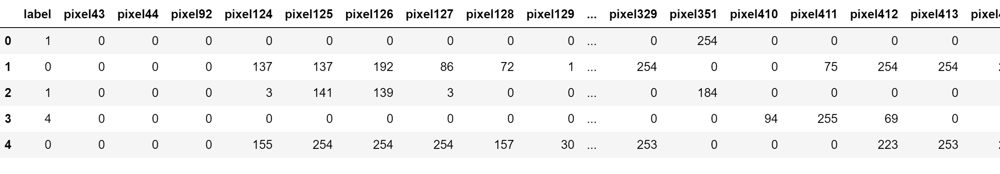
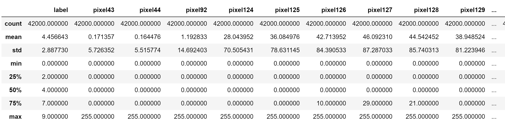
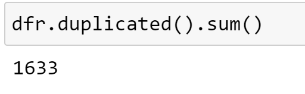
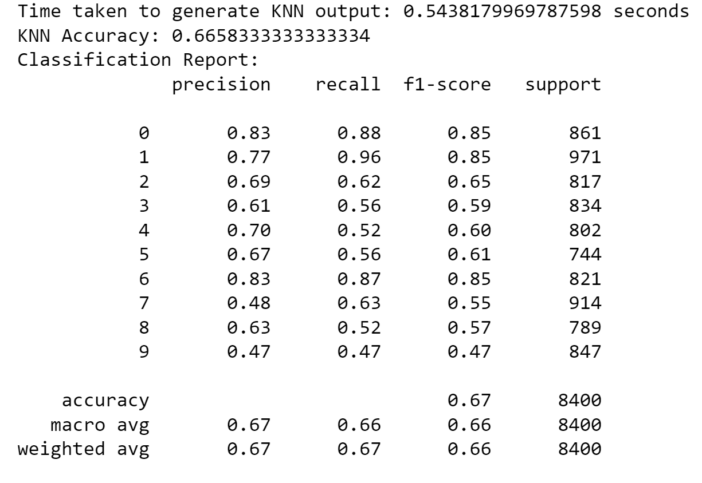
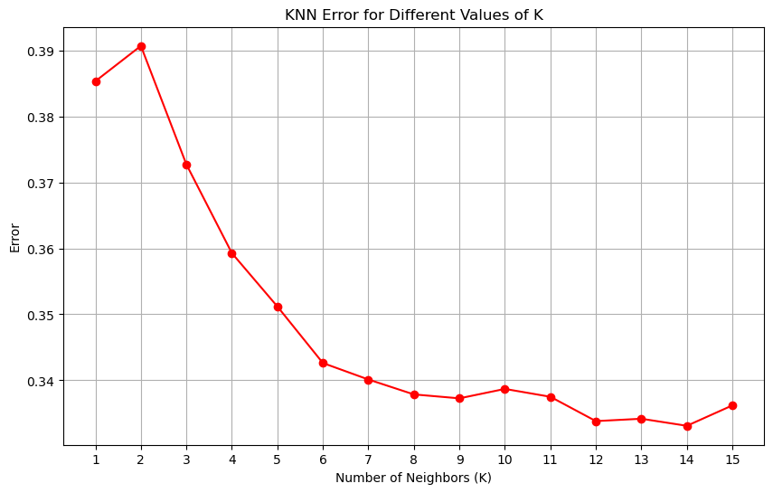
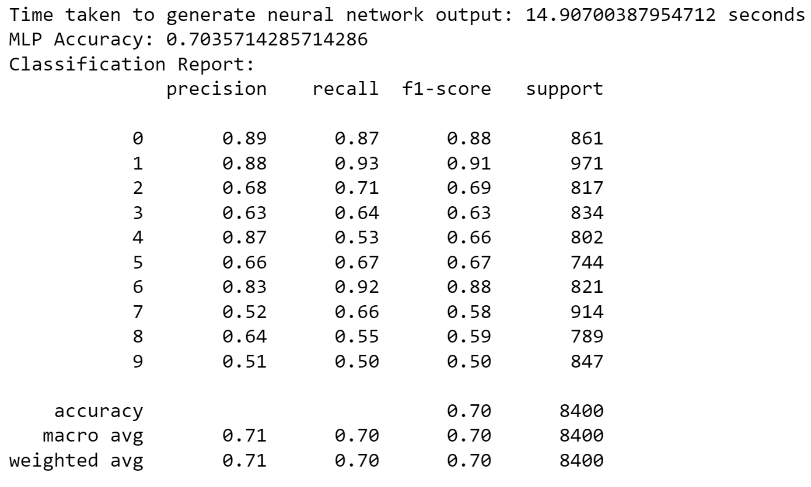
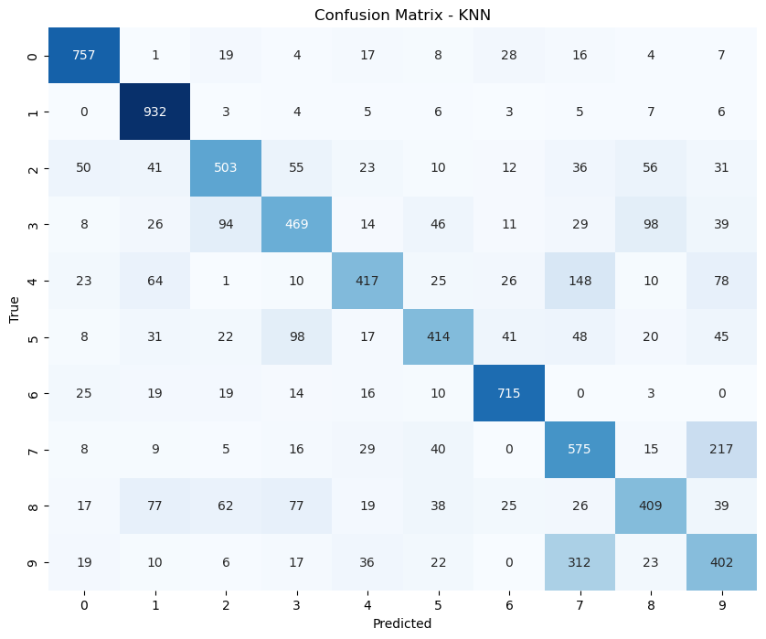
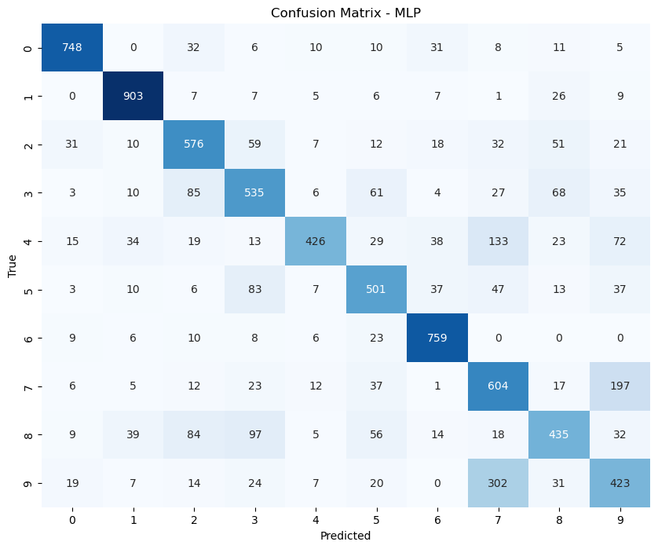

Letter Prediction

Pratik Amol Halurkar

Module 5 assignment

ALY6020: Predictive Analytics (CRN: 20356)

Prof. Justin Grosz

3/24/2024

# Introduction

In this assignment, we will analyze a dataset containing letters. The
school is exploring the possibility of using a writing test to assess
students' motor skills at a young age. As part of this effort, students
are asked to write numbers, and our task is to build a predictive model
to determine the accuracy of their handwriting. The objective is to
assist the school in identifying students who may require additional
support based on their handwriting proficiency.

We will explore whether employing either a KNN model or a Neural Network
model would be beneficial for this purpose. If the model can accurately
recognize handwritten numbers, it could provide valuable insights into
identifying students in need of extra assistance. Leveraging data
analytics techniques, we will thoroughly examine the dataset, construct
multiple models, and recommend the most suitable approach.

# Data cleaning and preprocessing

Understanding the dataset involves recognizing that each row represents
a single handwritten image, with the 'label' column indicating the
actual digit or letter represented by the image. These numbers tell us
how bright each tiny dot, or pixel, is in the image. Also, there's a
label attached to each image, telling us which digit it represents, like
'0', '1, '2', and so on.

Now, let's talk about those pixel columns. They're like a grid where
each number in a column represents the brightness of a pixel in the
image. The numbers range from 0 to 255, where 0 means the pixel is
totally black, and 255 means it's totally white. Everything else is
somewhere in between, showing different shades of gray.

Each row in our dataset is like a snapshot of a handwritten letter. The
label tells us what letter it is, and the pixel values give us the
details of how the letter looks. By looking at these pixel values, we
can start to see patterns that help us figure out which letter is which.

The dataset, consisting of 42,000 rows and 46 columns, was thoroughly
examined for any data anomalies. Despite the absence of missing values,
it was discovered that 1,633 rows were duplicated. Descriptive
statistics were computed to gain insights into the numerical features,
providing key statistical metrics such as mean, standard deviation, and
quartiles for each feature. These statistics offered valuable
information about the distribution and variation of pixel values across
different columns, aiding in the understanding of the dataset's
characteristics.

The mean, standard deviation (std), minimum (min), and maximum (max)
values offer essential insights into the distribution and
characteristics of pixel values in our dataset, revealing information
about brightness levels and variability. The mean value represents the
average brightness level across all images. For instance, pixel 43 has a
mean value of approximately 0.17, indicating a relatively low average
brightness for this pixel. Standard deviation measures the variability
of pixel values around the mean. A higher standard deviation, like the
one for pixel 44 at approximately 5.73, suggests significant variability
in brightness levels across images, likely due to various handwriting
styles or scanning conditions. The minimum and maximum values of a pixel
indicate the darkest and brightest intensities observed in the dataset,
respectively. In our dataset ranging from 0 to 255, a minimum value of 0
signifies black pixels, while a maximum value of 255 signifies white
pixels. For example, pixel 92 has a minimum value of 0 and a maximum
value of 255, indicating a wide range of brightness levels from black to
white across the dataset.

One reason not to remove duplicates in this dataset is because they
might represent important variations in the data. In the case of
handwritten digits, duplicates could happen because different people
write the same digit in slightly different ways, or there might be
variations in writing styles. Keeping duplicates helps to maintain this
variation, which can be useful for training machine learning models.
These variations allow the model to learn better by exposing it to
different versions of the same digit. Removing duplicates could result
in losing important information, which could make it harder for the
model to accurately classify handwritten digits. Moreover, removing
duplicates might unintentionally favor certain handwriting styles or
patterns, potentially introducing bias into the model. Keeping
duplicates ensures that the dataset reflects the natural variability
found in handwritten digits, making the model more reliable and robust.

# Model Development

For our analysis, we constructed two models: a K-nearest neighbor (KNN)
model and a Neural Network model. Before initiating model construction,
we performed two essential tasks. Firstly, we carefully selected the
independent variables, which are the features used to make predictions,
and the dependent variable, which is what we aim to predict. In our
case, the dependent variable is labeled "Label."

Following the selection of independent and dependent variables, we
divided the dataset into distinct training and testing sets. This
division, utilizing an 80-20 split ratio, ensures the effectiveness of
both model training and evaluation. The training set, consisting of 80%
of the data, serves as the foundation for teaching our models to discern
underlying patterns and relationships within the dataset. Meanwhile, the
remaining 20% of the data, allocated to the testing set, provides an
independent dataset for assessing the models' performance and their
ability to generalize to unseen data.

We used MinMaxScaler to make sure all our pixel values are on the same
scale, from 0 to 1. This helps because sometimes pixel values can have
different ranges, and we want to treat them equally. By scaling them
this way, we ensure that no single pixel's value dominates the model's
training process just because it has a larger number. It also helps the
model learn faster and perform better, especially for algorithms like
K-nearest neighbors and neural networks. So, MinMaxScaler was the right
choice to get our pixel values standardized and ready for training our
models.

# K-nearest neighbor (KNN) model

In the K-nearest neighbour (KNN) model analysis, a value of 13 was
chosen for the hyperparameter *k*. This value represents the number of
nearest neighbors considered by the model when making predictions for a
new data point. The selection of the optimal *k* value is crucial as it
directly impacts the model's performance and ability to generalize to
unseen data.

The K-nearest neighbor (KNN) model exhibited a commendable accuracy of
approximately 66.58%. This accuracy metric indicates the proportion of
correctly predicted instances out of the total instances evaluated,
providing a useful measure of the model's overall performance.

In terms of computational efficiency, the KNN model demonstrated a
relatively low execution time, taking approximately 0.54 seconds to
generate predictions. This rapid processing time suggests that the model
can efficiently analyze and classify data, making it suitable for
real-time applications or scenarios requiring quick responses.

Delving into the classification report, which provides a detailed
breakdown of the model's performance across different classes, we
observe variations in precision, recall, and F1-score metrics. For
instance, the precision for class 0 (representing the label '0') is
relatively high at 0.83, indicating that when the model predicts an
instance to be '0', it is correct approximately 83% of the time.
Similarly, the recall for class 1 is notably high at 0.96, indicating
that the model effectively captures the majority of instances belonging
to class 1.

However, the model's performance varies across different classes, as
evidenced by the differences in precision, recall, and F1-score values.
For instance, classes such as 7 and 9 exhibit lower precision and recall
values compared to classes like 1 and 6. This discrepancy suggests that
the model may struggle to accurately classify instances belonging to
certain classes, potentially indicating areas for further improvement or
fine-tuning.

Based on the KNN error values for different values of *k*, the choice of
*k*=13 can be justified as it represents a point of relative stability
in the error curve.

As the value of *k* increases from 1 to 13, the error rate generally
decreases, indicating an improvement in the model's performance.
However, beyond *k*=13, the error rate starts to increase slightly,
suggesting a degradation in model performance.

The error curve exhibits a downward trend from *k*=1 to *k*=13,
indicating that increasing the number of neighbors considered for
prediction leads to better generalization and lower error rates.
However, beyond *k*=13, the error curve begins to flatten out,
suggesting diminishing returns in terms of error reduction.

At *k*=13, the error rate reaches a relatively low value of 0.334,
indicating that the model achieves a favorable balance between bias and
variance. This choice minimizes the risk of overfitting while still
capturing sufficient local information from the dataset to make accurate
predictions.

Furthermore, selecting *k*=13 helps mitigate the potential risk of
underfitting that may occur with larger values of *k*. By striking this
balance, the model aims to achieve optimal performance in terms of both
accuracy and generalization to unseen data.

Overall, the selection of *k*=13 as the optimal value is supported by
the observed trend in the error curve, indicating a point of stability
where further increases in *k* do not significantly improve model
performance.

## Challenges

KNN is sensitive to feature scaling. In our case, since we're dealing
with image data, the pixel values may have different scales. Failure to
scale the features appropriately could result in certain features having
a disproportionately large influence on the distance calculations,
potentially biasing the model's predictions. Secondly, KNN is
susceptible to the curse of dimensionality. As the number of features
(dimensions) in the dataset increases, the volume of the feature space
grows exponentially. This can lead to sparsity in the data, making it
difficult to identify meaningful nearest neighbors and adversely
affecting the model's performance.

# Neural Network Model

In our neural network model, we specified the architecture using the
**hidden_layer_sizes** parameter, which defines the number of neurons in
each hidden layer. The chosen architecture comprises seven hidden layers
with decreasing neuron counts: 128, 100, 80, 60, 40, 20, and 10 neurons,
respectively. This architecture allows the model to learn complex
patterns from the data by progressively extracting and abstracting
features through multiple layers.

We employed the Rectified Linear Unit (ReLU) activation function
(**activation='relu'**) in each hidden layer. ReLU is commonly used in
neural networks due to its ability to introduce non-linearity,
facilitating the learning of intricate relationships within the data
while mitigating the vanishing gradient problem.

For optimization, we utilized the Adam solver (**solver='adam'**), which
efficiently adjusts the learning rate during training. Additionally, we
employed an adaptive learning rate schedule
(**learning_rate='adaptive'**) to dynamically adjust the learning rate
based on model performance. This adaptive approach enhances convergence
and stability during training.

To prevent overfitting, we applied L2 regularization (**alpha=0.0001**)
by penalizing large parameter values. This regularization technique
helps prevent the model from fitting the training data too closely,
improving its ability to generalize to unseen data.

The **max_iter** parameter was set to 40, limiting the maximum number of
iterations or epochs during training. This helps prevent excessive
training time and potential overfitting, ensuring that the model does
not continue to learn indefinitely.

The model took approximately 14.91 seconds to generate its output,
indicating a moderate computational overhead during the training
process. This duration is acceptable for practical applications,
balancing the trade-off between computational efficiency and model
performance.

The accuracy of the neural network model was found to be approximately
70.36%. This metric represents the proportion of correctly classified
instances out of the total instances in the test set. A 70% accuracy
rate suggests that the model can effectively differentiate between
different handwritten digits, demonstrating its capability to learn and
generalize patterns from the input data.

For instance, the precision of class '0' is 0.89, indicating that 89% of
the instances classified as '0' were correctly classified. Similarly,
the recall for class '1' is 0.93, indicating that 93% of the actual
instances of '1' were correctly classified by the model. The F1-score,
which is the harmonic mean of precision and recall, provides a balanced
measure of a model's performance.

Overall, the macro and weighted averages of precision, recall, and
F1-score metrics are around 0.71, indicating a relatively consistent
performance across all classes. These metrics collectively suggest that
the neural network model exhibits a balanced performance in classifying
handwritten digits, with reasonable precision, recall, and F1-scores
across various digit classes.

## Challenges

One challenge is related to model complexity and overfitting. Neural
networks, especially with multiple hidden layers and a large number of
neurons, have a high capacity to learn intricate patterns in the
training data. However, this complexity can sometimes lead to
overfitting, where the model learns to memorize the training data
instead of capturing underlying patterns. Overfitting can result in poor
generalization to unseen data, reducing the model's performance on the
test set.

Additionally, tuning the hyperparameters of the neural network, such as
the number of hidden layers, the number of neurons per layer, and the
learning rate, can be challenging. Each hyperparameter choice can
significantly impact the model's performance and training time. For
example, selecting an inadequate number of hidden layers or neurons may
limit the model's capacity to learn complex patterns, while choosing
excessively large values may lead to longer training times and increased
risk of overfitting.

Another challenge is the computational resources required for training
neural networks, especially with large datasets and complex
architectures. Training a neural network with multiple layers and
neurons may demand substantial computational power and time. Therefore,
optimizing the neural network architecture and training process to
strike a balance between model complexity and computational efficiency
is essential.

# Multiple Benchmarking

The comparison of the K-Nearest Neighbors (KNN) model and the Neural
Network model unveils distinctive performances across various metrics.
Starting with accuracy, the Neural Network model outperforms KNN,
achieving an accuracy of 70.36% compared to KNN's 66.58%. This indicates
that the Neural Network model predicts the correct digit label for a
higher proportion of instances in the dataset compared to KNN.

When examining precision, which measures the proportion of correctly
predicted positive cases out of all instances predicted as positive, the
Neural Network model demonstrates a slightly higher precision of 71%
compared to KNN's precision of 67%. This implies that the Neural Network
model has a slightly lower false positive rate than the KNN model,
making it more adept at correctly identifying true positive instances.

Recall, on the other hand, assesses the proportion of correctly
predicted positive cases out of all actual positive cases in the
dataset. Here, both models exhibit similar recall rates, with the Neural
Network model achieving a recall of 70% and KNN achieving 66%. This
suggests that both models are relatively effective at capturing true
positive instances within the dataset.

Moving to the F1-score, which represents the harmonic mean of precision
and recall, the Neural Network model maintains a slightly higher score
of 70% compared to KNN's score of 66%. This indicates that the Neural
Network model achieves a better balance between precision and recall
than the KNN model.

In terms of computational efficiency, as reflected in the training time,
the KNN model significantly outperforms the Neural Network model, with a
training time of approximately 0.54 seconds compared to the Neural
Network's training time of around 14.91 seconds. While the KNN model
trains relatively quickly, the Neural Network model requires
substantially more time to train due to its complex architecture and
iterative training process.

# Conclusion and Recommendations

Our evaluation of models for predicting what students have drawn,
particularly focusing on recognizing handwritten numbers, offers
valuable insights for educational applications. Both the K-Nearest
Neighbors (KNN) and Neural Network models demonstrate potential for
identifying handwritten digits, with varying strengths and
considerations.

The Neural Network model exhibits higher accuracy, precision, recall,
and F1-score compared to the KNN model. This suggests its capability to
effectively identify and classify handwritten numbers, which is crucial
for assessing student work in educational settings. The Neural Network's
superior performance indicates its potential to accurately pinpoint
students who may need more assistance based on their drawn digits.

However, it's essential to consider the trade-offs associated with the
Neural Network model, particularly its longer training times. While it
excels in predictive accuracy, the time taken to train the model may
impact real-time feedback in educational scenarios. This aspect should
be carefully evaluated against the urgency of identifying students in
need of additional support.

Based on these observations, I recommend the following specific actions:

Integrating the Neural Network model into our educational platform holds
significant promise for addressing our specific problem of identifying
students' handwritten numbers. By seamlessly incorporating the model's
capabilities, we can automate the analysis and classification of
students' drawings, specifically focusing on numerical concepts. This
integration streamlines the identification process, enabling educators
to efficiently pinpoint students who may require additional support with
numerical comprehension.

Furthermore, developing mechanisms for real-time feedback based on the
model's predictions is essential for enhancing student learning
outcomes. Timely feedback provides an opportunity for immediate
intervention, particularly for students struggling with number
recognition. By promptly addressing areas of difficulty, we can foster
faster learning and improvement, ultimately facilitating a more
supportive and responsive learning environment.

Continuous optimization of the Neural Network model is crucial to
ensuring its accuracy and efficiency in our educational context.
Techniques such as hyperparameter tuning, data augmentation, and model
architecture adjustments can be explored to enhance performance while
mitigating training time. This optimization process is vital for
maintaining the model's effectiveness over time and adapting to evolving
educational needs.

Designing a user-friendly interface for educators to interpret and act
upon the model's predictions is paramount for seamless integration into
educational workflows. Clear visualization of the model's output and
actionable insights empower educators to make informed decisions about
providing targeted support to students in need. A user-friendly
interface enhances usability and promotes widespread adoption of the
model within educational settings.

By integrating the Neural Network model into our educational platform
and implementing mechanisms for real-time feedback, model optimization,
user-friendly interface design, and continuous evaluation, we can
effectively address our problem of identifying students' handwritten
numbers.

# References

C. (2020, April 10). *Neural Networks - Lecture 5 - CS50’s Introduction
to Artificial Intelligence with Python 2020*. YouTube.
<https://www.youtube.com/watch?v=mFZazxxCKbw>

*sklearn.neural_network.MLPClassifier*. (n.d.). Scikit-learn.
<https://scikit-learn.org/stable/modules/generated/sklearn.neural_network.MLPClassifier.html>

# Appendix

